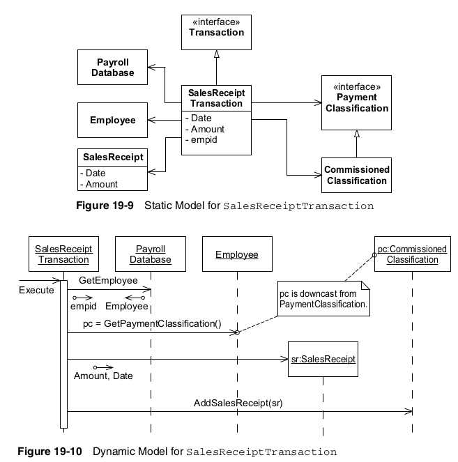

## batch payroll system

This system consists of a database of the employees in the company and their associated data, such as time
cards. The system must pay each employee. Employees must be paid the correct amount, on time, by the method
that they specify. Also, various deductions must be taken from their pay.

- Some employees work by the hour. They are paid an hourly rate that is one of the fields in their employee
record. They submit daily time cards that record the date and the number of hours worked. If they work more
than 8 hours per day, they are paid 1.5 times their normal rate for those extra hours. They are paid every
Friday.

- Some employees are paid a flat salary. They are paid on the last working day of the month. Their monthly
salary is one of the fields in their employee record.

- Some of the salaried employees are also paid a commission based on their sales. They submit sales receipts
that record the date and the amount of the sale. Their commission rate is a field in their employee record.
They are paid every other Friday.

- Employees can select their method of payment. They may have their paychecks mailed to the postal address
of their choice; they may have their paychecks held for pickup by the Paymaster; or they can request that
their paychecks be directly deposited into the bank account of their choice.

- Some employees belong to the union. Their employee record has a field for the weekly dues rate. Their dues
must be deducted from their pay. Also, the union may assess service charges against individual union mem-
bers from time to time. These service charges are submitted by the union on a weekly basis and must be
deducted from the appropriate employee’s next pay amount.

- The payroll application will run once each working day and pay the appropriate employees on that day. The
system will be told to what date the employees are to be paid, so it will calculate payments from the last time
the employee was paid up to the specified date.


### Use Case 1: Add New Employee

A new employee is added by the receipt of an AddEmp transaction. This transaction contains the employee’s
name, address, and assigned employee number. The transaction has the following three forms:

```
AddEmp <EmpID> “<name>” “<address>” H <hourly-rate>
AddEmp <EmpID> “<name>” “<address>” S <monthly-salary>
AddEmp <EmpID> “<name>” “<address>” C <monthly-salary> <commission-rate>
```

The employee record is created with its fields assigned appropriately.

**Alternative:**

> An error in the transaction structure  


If the transaction structure is inappropriate, it is printed out in an error message, and no action is taken.


### Use Case 2: Deleting an Employee

Employees are deleted when a DelEmp transaction is received. The form of this transaction is as follows:

```
DelEmp <EmpID>
```

When this transaction is received, the appropriate employee record is deleted.

**Alternative:**

> Invalid or unknown EmpID  


If the <EmpID> field is not structured correctly, or if it does not refer to a valid employee record, then the
transaction is printed with an error message, and no other action is taken.

### Use Case 3: Post a Time Card

Upon receipt of a TimeCard transaction, the system will create a time-card record and associate it with the
appropriate employee record.

```
TimeCard <Empld> <date> <hours>
```

**Alternative 1:**

> The selected employee is not hourly  


The system will print an appropriate error message and take no further action.

**Alternative 2:**

> An error in the transaction structure  


The system will print an appropriate error message and take no further action.

### Use Case 4: Posting a Sales Receipt

Upon receipt of the SalesReceipt transaction, the system will create a new sales-receipt record and asso-
ciate it with the appropriate commissioned employee.

```
SalesReceipt <EmpID> <date> <amount>
```

**Alternative 1:**

> The selected employee is not commissioned  


The system will print an appropriate error message and take no further action.

**Alternative 2:**

> An error in the transaction structure  
	

The system will print an appropriate error message and take no further action.

### Use Case 5: Posting a Union Service Charge

Upon receipt of this transaction, the system will create a service-charge record and associate it with the
appropriate union member.

```
ServiceCharge <memberID> <amount>
```

**Alternative:**

> Poorly formed transaction  


If the transaction is not well formed or if the <memberID> does not refer to an existing union member, then
the transaction is printed with an appropriate error message.

### Use Case 6: Changing Employee Details

Upon receipt of this transaction, the system will alter one of the details of the appropriate employee record.
There are several possible variations to this transaction.

```
ChgEmp <EmpID> Name <name>                     Change Employee Name
ChgEmp <EmpID> Address <address>               Change Employee Address
ChgEmp <EmpID> Hourly <hourlyRate>             Change to Hourly
ChgEmp <EmpID> Salaried <salary>               Change to Salaried
ChgEmp <EmpID> Commissioned <salary> <rate>    Change to Commissioned
ChgEmp <EmpID> Hold                            Hold Paycheck
ChgEmp <EmpID> Direct <bank> <account>         Direct Deposit
ChgEmp <EmpID> Mail <address>                  Mail Paycheck
ChgEmp <EmpID> Member <memberID> Dues <rate>   Put Employee in Union
ChgEmp <EmpID> NoMember                        Remove Employee from Union           
```

**Alternative:**

> Transaction Errors  


If the structure of the transaction is improper or <EmpID> does not refer to a real employee or <memberID>
already refers to a member, then print a suitable error and take no further action.


### Use Case 7: Run the Payroll for Today

Upon receipt of the Payday transaction, the system finds all those employees that should be paid upon the
specified date. The system then determines how much they are owed and pays them according to their
selected payment method.

```
Payday <date>
```

Remember the definition of abstraction: 
  
> **the amplification of the essential and the elimination of the irrelevant.**

<br/>

### Analysis by Use Cases

> One way to capture and analyze the behavior of a system is to create **use cases**.

>> A **use case** is like a **user story** that has been elaborated with a little more detail.

<br/>

>> For use case analysis, we look to the user stories and acceptance tests to find out the kinds of stimuli that the users of this system provide.

<br/>

>> Then we try to figure out how the system responds to those stimuli.

<br/>

> user stories that our customer has chosen for the next iteration:

<br/>

1. Add a new employee
2. Delete an employee
3. Post a time card
4. Post a sales receipt
5. Post a union service charge
6. Change employee details (e.g., hourly rate, dues rate.)
7. Run the payroll for today


Note:

Developers tend to underestimate large stories and overestimate small ones:

For example, consider the story, 'Users can securely transfer money into, out of, and between their accounts.' This is a big story. Estimating will be hard and probably inaccurate. However, we can split it as follow, into many stories that are much easier to estimate:

- Users can log in.
- Users can log out.
- Users can deposit money into their account.
- Users can withdraw money from their account.
- Users can transfer money from their account to another account.

Relative estimates don’t tell us the absolute size of the stories. In order to know the true size of a story, we need a factor that we call **velocity**.

If we have an accurate velocity, we can multiply the estimate of any story by the velocity to get the actual time estimate for that story.

For example, if our velocity is `2 days per story point`, and we have a story with a relative estimate of `four points`, then the story should take `eight days` to implement.

Let’s convert each of these user stories into an elaborated use case.

#### Adding Employees

### Finding the Underlying Abstractions

What are the underlying abstractions of the Payroll application? Let’s look again at the requirements. We see statements such as

- Some employees work by the hour,
- Some employees are paid a flat salary, and 
- Some [...] employees are paid a commission. 
  
  This hints at the following generalization: **All employees are paid, but they are paid by different schemes**.

> The abstraction here is that **All employees are paid.**  

<br/>

#### The Schedule Abstraction

Looking for other abstractions, we find 

- They are paid every Friday,
- They are paid on the last working day of the month, and 
- They are paid every other Friday.

This leads us to another generality: **All employees are paid according to some schedule.**

The abstraction here is the notion of the `schedule`. It should be possible to ask an `Employee` object whether a certain date is its payday.

The requirements associate an employee’s schedule with his payment classification 

- hourly employees are paid weekly, 
- salaried employees are paid monthly, and 
- employees receiving commissions are paid biweekly; 
  
however, is this association essential?

Might not the policy change one day so that employees could select a particular schedule or so that employees belonging to different departments or different divisions could have different schedules?

Might not the schedule policy change independently of the payment policy?

If we delegated the issue of schedule to the ‍‍‍`PaymentClassification` class, then our class could not be closed against issues of change in schedule. When we **changed payment policy**, we would also have to **test schedule**. When we **changed schedules**, we would also have to **test payment policy**. **Both the OCP and the SRP would be violated.**

The `Employee` class contains the abstract `PaymentSchedule` class. There are three varieties of `PaymentSchedule` that correspond to the three known schedules by which employees are paid.

#### Payment Methods

Another generalization that we can make from the requirements is 

- All employees receive their pay by some method. 

The abstraction is the `PaymentMethod` class. 

#### Affiliations

The requirements imply that employees may have affiliations with a union; however, the union may not be the only organization that has a claim to some of an employee’s pay. Employees might want to make automatic contributions to certain charities or have their dues to professional associations paid automatically.

The generalization therefore becomes 

- **The employee may be affiliated with many organizations that should be automatically paid from the employee’s paycheck.**

The corresponding abstraction is the `Affiliation` class.that is shown in below Figure. That figure, however, does not show the `Employee` containing more than one `Affiliation` , and it shows the presence of a `NoAffiliation` class. This design does not quite fit the abstraction we now think we need. 


below Figure show the static and dynamic models that represent the `Affiliation` abstraction.


The list of `Affiliation` objects has obviated the need to use the **NULL OBJECT pattern** for unaffiliated employees. Now, if the employee has no affiliation, his or her list of affiliations will simply be empty.


#### Adding Employees



