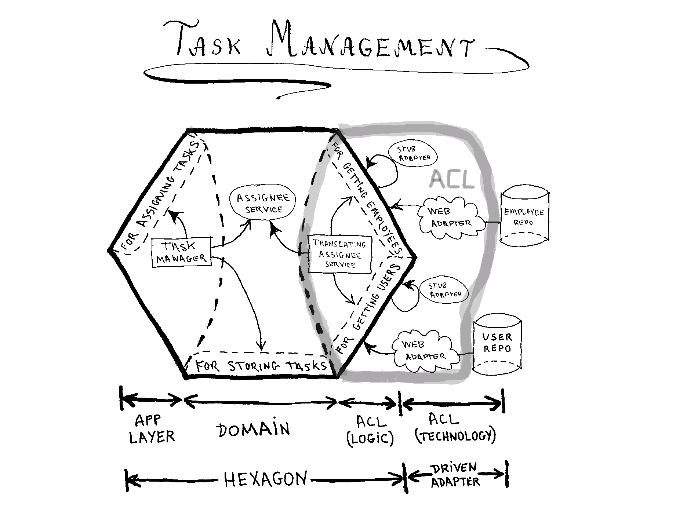

From https://jmgarridopaz.github.io/content/therightboundary.html
See https://web.archive.org/web/20170925184018/http://alistair.cockburn.us/Hexagonal+Architecture+FAQ
See https://tpierrain.blogspot.com/2020/04/adapters-are-true-heralds-of-ddd.html
See https://tpierrain.blogspot.com/2020/03/hexagonal-architecture-dont-get-lost-on.html
See https://web.archive.org/web/20170925184018/http://alistair.cockburn.us/Hexagonal+architecture
See https://web.archive.org/web/20170925184018s/http://alistair.cockburn.us/elephant+carpaccio)
See https://web.archive.org/web/20170620145208/http://alistair.cockburn.us/Structuring+use+cases+with+goals
See https://github.com/Lunch-box/SimpleOrderRouting
sEE https://github.com/Lunch-box/SimpleOrderRouting/wiki/Logbook-4#day-15-october-27th-2014

See https://github.com/jmgarridopaz/discounter/tree/main
https://github.com/jmgarridopaz/coffee-machine
https://github.com/jmgarridopaz/lib-portsadapters
https://github.com/jmgarridopaz/hexawordle
https://github.com/jmgarridopaz/lib-commandbus
https://github.com/jmgarridopaz/lib-javalangutils
https://github.com/jmgarridopaz/task-management
https://github.com/jmgarridopaz/bluezone

### EXAMPLE APPLICATION

**Task Management*** is an application, a collaborative tool, used by employees of a company for assigning tasks to each other. The domain model has concepts like “assignee”, that is the employee who a task is assigned to, and has to perform it. An assignee has an id, a unique short name kindof an alias, and an email.

###  DDD CONTEXT MAP

> Company, with information about employees, which have properties like id, first name, last name, email, job.

 

> Identity and Access, with information about the users of our application. Users have an id, a login name, and a password. A user is an employee, the user id is the employee id.

 

[Alistair Cockburn](https://web.archive.org/web/20170925184018/http://alistair.cockburn.us/Hexagonal+Architecture+FAQ): A port is an interface that groups interactions with a repository/recipient:

- step 1. Draw a circle (or a hexagon). **Put everything that touches the real world on the outside**. That includes humans, servers, databases, …

- step 2. **Organize all the interactions across the boundary** of that hexagon… things that provide information to the application (I’ll call these **repositories**), things that get notified by the application (I’ll call these **recipients**). Each of those capture a **set of verbs or function calls or interactions, and makes a port or interface…**

- step 3. Label those clusters with a verb ending in “-ing” (present participle) saying what they are for. For example: … This **repository port** is for “obtaining information about (whatever)”. This **recipient port** is for “notifying recipients about (whatever)”

- step 4. Allow any desired technology to operate to those interfaces using some adapter code… **on the recipient or repository side, adapters allow different technologies to respond to requests and notification:** mock databases, flat files, real databases, and so on.
