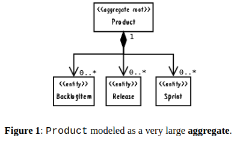
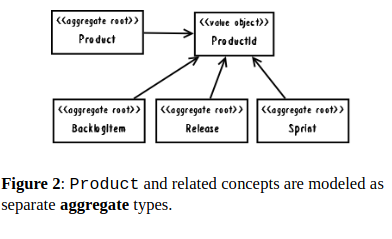
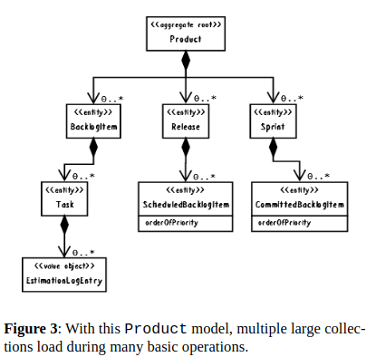
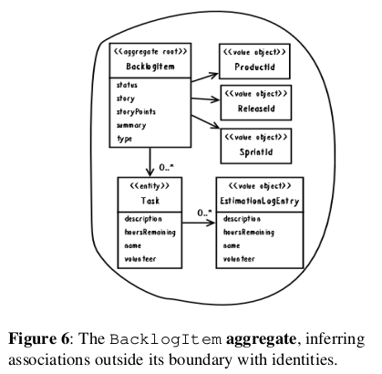
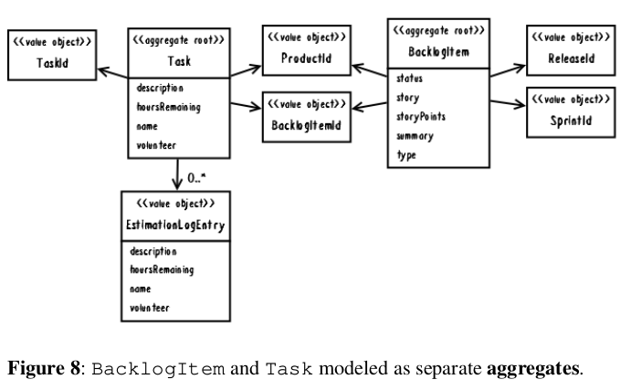

See https://www.dddcommunity.org/wp-content/uploads/files/pdf_articles/Vernon_2011_1.pdf
See https://www.dddcommunity.org/wp-content/uploads/files/pdf_articles/Vernon_2011_2.pdf
See https://www.dddcommunity.org/wp-content/uploads/files/pdf_articles/Vernon_2011_3.pdf

See https://www.mirkosertic.de/blog/2013/04/domain-driven-design-example/

## Designing a Scrum Management Application

product, product owner, team, backlog items, planned releases, and sprints.

> The Scrum terminology forms the starting point of the **ubiquitous language**.

<br/>

> It is a subscription-based application hosted using the software as a service (SaaS) model. 

<br/>

> Each subscribing organization is registered as a tenant, another term for our **ubiquitous language**.

<br/>

The team considered the following statements in the ubiquitous language:

- Products have backlog items, releases, and sprints.
- New product backlog items are planned.
- New product releases are scheduled.
- New product sprints are scheduled.
- A planned backlog item may be scheduled for release.
- A scheduled backlog item may be committed to a sprint

### First Attempt: Large-Cluster Aggregate 

The team put a lot of weight on the words **Products have** in the first statement. It sounded to some like composition, that objects needed to be interconnected like an object graph. Maintaining these object life cycles together was considered very important. So, the developers added the following consistency rules into the specification:

- if a backlog item is committed to a sprint, we must not allow it to be removed from the system.
- If a sprint has committed backlog items, we must not allow it to be removed from the system.
- If a release has scheduled backlog items, we must not allow it to be removed from the system.
- If a backlog item is scheduled for release, we mus not allow it to be removed from the system.

As a result, Product was first modeled as a very large aggregate.



Consider a common simultaneous, multi-client usage scenario:

- Two users, Bill and Joe, view the same Product marked as version 1, and begin to work on it.
- Bill plans a new BacklogItem and commits. The Product version is incremented to 2.
- Joe schedules a new Release and tries to save, but his commit fails because it was based on Product version 1.

Failing all but one of their requests on an ongoing basis is completely unacceptable.

**Nothing about planning a new backlog item should logically interfere with scheduling a new release! Why did Joe's commit fail?** 

**At the heart of the issue, the large cluster aggregate was designed with false invariants in mind, not real business rules.**

### Second Attempt: Multiple Aggregates



Each of the dependencies is associated by inference using a common ProductId, which is the identity of Product considered the parent of the other three.

With the large cluster aggregate design the method signatures looked like this:

```java
public class Product ... {
...
    public void planBacklogItem(String aSummary, String aCategory,
            BacklogItemType aType, StoryPoints aStoryPoints) {
    }
    public void scheduleRelease(String aName, String aDescription,
            Date aBegins, Date anEnds) {
    ...
    }
    public void scheduleSprint(String aName, String aGoals,
        Date aBegins, Date anEnds) {
    ...
    }
...
}    
...
```

All of these methods are [CQS] commands. That is, they
modify the state of the Product by adding the new ele-
ment to a collection, so they have a void return type. But
with the multiple aggregate design, we have:

```java
public class Product ... {
    ...
    public BacklogItem planBacklogItem(String aSummary, String aCategory,
        BacklogItemType aType, StoryPoints aStoryPoints) {
        ...
    }
    public Release scheduleRelease(String aName, String aDescription,
                Date aBegins, Date anEnds) {
        ...
    }
    public Sprint scheduleSprint(String aName, String aGoals,
            Date aBegins, Date anEnds) {
        ...
    }
    ...
}

```

These redesigned methods have a [CQS] query contract,
and act as factories. That is, they each respectively create a
new aggregate instance and return a reference to it. Now
when a client wants to plan a backlog item, the transaction-
al application service must do the following:

```java
@RequiredArgsConstructor
public class ProductBacklogItemService {

    private final ProductRepository productRepository;
    private final BacklogItemRepository backlogItemRepository;

    @Transactional
    public void planProductBacklogItem(String aTenantId, String aProductId,
            String aSummary, String aCategory,
            String aBacklogItemType, String aStoryPoints) {

        Product product = productRepository.productOfId(
                new TenantId(aTenantId),
                new ProductId(aProductId));

        BacklogItem plannedBacklogItem = product.planBacklogItem(
                aSummary,
                aCategory,
                BacklogItemType.valueOf(aBacklogItemType),
                StoryPoints.valueOf(aStoryPoints));

        backlogItemRepository.add(plannedBacklogItem);
    }
}
```

### Rule: Model True Invariants In Consistency Boundaries

When trying to discover the **aggregates** in a **bounded context**, we must understand the model's true invariants. Only with that knowledge can we determine which objects should be clustered into a given **aggregate**.

**An invariant is a business rule that must always be consistent.**

> There are different kinds of consistency.  


>> One is transactional, which is considered immediate and atomic.  

>> There is also eventual consistency.  

**When discussing invariants, we are referring to transactional consistency.**

We might have the invariant:

```
c = a + b
```

Therefore, when a is 2 and b is 3, c must be 5.

**According to that rule and conditions, if c is anything but 5, a system invariant is violated.** 

To ensure that c is consistent, we model a boundary around these specific attributes of the model:

```java
AggregateType1 {
    int a;
    int b;
    int c;

    operations...
}
```

**The consistency boundary logically asserts that everything inside adheres to a specific set of business invariant rules no matter what operations are performed.**

The consistency of everything outside this boundary is irrelevant to the **aggregate**. 

Thus, **aggregate** is synonymous with transactional consistency boundary.

When employing a typical persistence mechanism we use a single transaction3 to manage consistency.

**When the transaction commits, everything inside one boundary must be consistent.**

A properly designed **aggregate** is one that can be modified in any way required by the business with its invariants completely consistent within a single transaction.

**And a properly designed bounded context modifies only one aggregate instance per transaction in all cases.**

**Since aggregates must be designed with a consistency focus, it implies that the user interface should concentrate each request to execute a single command on just one aggregate instance.** 

If user requests try to accomplish too much, it will force the application to modify multiple instances at once.

**Therefore, aggregates are chiefly about consistency boundaries and not driven by a desire to design object graphs.**

### Rule: Design Small Aggregates



If we are going to design small **aggregates**, what does **small** mean? 

The extreme would be an **aggregate** with only its globally unique identity and one additional attribute, which is not what's being recommended (unless that is truly what one specific **aggregate** requires). Rather, limit the **aggregate** to just the **root entity** and a minimal number of attributes and/or **value**-typed properties.4 The correct minimum is the ones necessary, and no more.

**Which ones are necessary?** The simple answer is: **those that must be consistent with others**, even if domain experts don't specify them as rules.

For example, `Product` has `name` and `description` attributes.  We can't imagine `name` and `description` being inconsistent, modeled in separate **aggregates**. 

When you change the `name` you probably also change the `description`. If you change one and not the other, it's probably because you are fixing a spelling error or making the `description` more fitting to the `name`.

Even though domain experts will probably not think of this as an explicit business rule, it is an implicit one.

What if you think you should model a contained part as an **entity**? 

First ask whether that part must itself change over time, or whether it can be completely replaced when change is necessary. 

 **If instances can be completely replaced, it points to the use of a value object rather than an entity.**

 **At times entity parts are necessary.**

 Favoring **value** types as **aggregate** parts doesn't mean the **aggregate** is immutable since the root entity itself mutates when one of its **value**-typed properties is replaced.

 There are important advantages to limiting internal parts to **values**. Depending on your persistence mechanism, **values** can be serialized with the **root entity**, whereas **entities** usually require separately tracked storage.

 **a high percentage of aggregates can be limited to a single entity, the root.**

 The [DDD] discussion of **aggregates** gives an example where multiple **entities** makes sense. 
 
 A purchase order is assigned a maximum allowable total, and the sum of all line items must not surpass the total.  The rule becomes tricky to enforce when multiple users simultaneously add line items. Any one addition is not permitted to exceed the limit, but concurrent additions by multiple users could collectively do so.  most of the time the invariants of business models are simpler to manage than that example. Recognizing this helps us to model **aggregates** with as few properties as possible.

 Smaller **aggregates** not only perform and scale better, they are also biased toward transactional success, meaning that conflicts preventing a commit are rare.

 Your domain will not often have true invariant constraints that force you into large composition design situations. When you occasionally encounter a true consistency rule, then add another few **entities**, or possibly a collection, as necessary, but continue to push yourself to keep the overall size as small as possible

 A common issue that arises is a particular use case that calls for
the modification of multiple aggregate instances. In such a
case we must determine whether the specified large user
goal is spread across multiple persistence transactions, or if
it occurs within just one. If it is the latter, it pays to be
skeptical. No matter how well it is written, such a use case
may not accurately reflect the true aggregates of our
model.

### Making Aggregates Work Together


this has a few implications:

1. Both the referencing **aggregate** (`BacklogItem`) and the referenced **aggregate** (`Product`) must not be modified in the same transaction. Only one or the other may be modified in a single transaction.

2. If you are modifying multiple instances in a single transaction, it may be a strong indication that your consistency boundaries are wrong. If so, it is possibly a missed modeling opportunity; a concept of your **ubiquitous languag**e has not yet been discovered although it is waving its hands and shouting at you.

3. If you are attempting to apply point #2, and doing so influences a large cluster **aggregate** with all the previously stated caveats, it may be an indication that you need to use eventual consistency instead of atomic consistency.


If you don't hold any reference, you can't modify another **aggregate**. So the temptation to modify multiple **aggregates** in the same transaction could be squelched by avoiding the situation in the first place.

But that is overly limiting since domain models always require some associative connections. What might we do to facilitate necessary associations, protect from transaction misuse or inordinate failure, and allow the model to perform and scale?




**Rule: Reference Other Aggregates By Identity**

Reference by identity doesn't completely prevent navigation through the model. Some will use a **repository** from inside an **aggregate** for look up. This technique is called **disconnected domain model**, and it's actually a form of lazy loading.

There's a different recommended approach, however: Use a **repository** or **domain service** to look up dependent objects ahead of invoking the **aggregate** behavior. A client **application service** may control this, then dispatch to the **aggregate**:

```java
public class ProductBacklogItemService ... {
...
    @Transactional
    public void assignTeamMemberToTask(
        String aTenantId,
        String aBacklogItemId,
        String aTaskId,
        String aTeamMemberId) {
        BacklogItem backlogItem =
            backlogItemRepository.backlogItemOfId(
                new TenantId(aTenantId),
                new BacklogItemId(aBacklogItemId));
        Team ofTeam =
            teamRepository.teamOfId(
                backlogItem.tenantId(),
                backlogItem.teamId());

        backlogItem.assignTeamMemberToTask(
                new TeamMemberId(aTeamMemberId),
                ofTeam,
                new TaskId(aTaskId));
    }
    ...
}
```

Having an **application service** resolve dependencies frees the **aggregate** from relying on either a **repository** or a **domain service**. Again, referencing multiple **aggregates** in one request does not give license to cause modification on two or more of them.

Limiting a model to using reference only by identity could make it more difficult to serve clients that assemble and render **user interface** views. You may have to use multiple **repositories** in a single use case to populate views. If query overhead causes performance issues, it may be worth considering the use of **CQRS** [Dahan, Fowler, Young]. Or you may need to strike a balance between inferred and direct object reference.

#### Scalability and Distribution

Since aggregates don't use direct references to other ag-
gregates, but reference by identity, their persistent state can
be moved around to reach large scale. Almost-infinite
scalability is achieved by allowing for continuous reparti-
tioning of aggregate data storage, as explained by
Amazon.com's Pat [Helland] in his position paper, Life
Beyond Distributed Transactions: an Apostate's Opinion.
What we call aggregate he calls entity. But what he de-
scribes is still aggregate by any other name; a unit of com-
position that has transactional consistency. Some NoSql
persistence mechanisms support the Amazon-inspired dis-
tributed storage. These provide much of what [Helland]
refers to as the lower, scale-aware layer. When employing a
distributed store, or even when using a SQL database with
similar motivations, reference by identity plays an import-
ant role.

Distribution extends beyond storage. Since there are always
multiple bounded contexts at play in a given core domain
initiative, reference by identity allows distributed domain
models to have associations from afar. When an event-driv-
en approach is in use, message-based domain events con-
taining aggregate identities are sent around the enterprise.
Message subscribers in foreign bounded contexts use the
identities to carry out operations in their own domain mod-
els. Reference by identity forms remote associations or
partners. Distributed operations are managed by what
[Helland] calls two-party activities; but in publish-
subscribe [POSA1, GoF] terms it's multi-party (two or
more). Transactions across distributed systems are not
atomic. The various systems bring multiple aggregates into
a consistent state eventually.


**Rule: Use Eventual Consistency Outside the Boundary**

There is a frequently overlooked statement found in the
[DDD] **aggregate** pattern definition. It bears heavily on
what we must do to achieve model consistency when mul-
tiple **aggregates** must be affected by a single client request.

Thus, if executing a command on one **aggregate** instance
requires that additional business rules execute on one or
more other **aggregates**, use eventual consistency. Accept-
ing that all **aggregate** instances in a large-scale, high-traffic
enterprise are never completely consistent helps us accept
that eventual consistency also makes sense in the smaller
scale where just a few instances are involved.

There is a practical way to support eventual consistency in a DDD model. An **aggregate** command method publishes a **domain event** that is in time delivered to one or more asynchronous subscribers:

```java
public class BacklogItem extends ConcurrencySafeEntity {
...
    public void commitTo(Sprint aSprint) {
    ...
    DomainEventPublisher
        .instance()
            .publish(new BacklogItemCommitted(
                this.tenantId(),
                this.backlogItemId(),
                this.sprintId()));
    }
    ...
}
```

These subscribers each then retrieve a different yet corresponding **aggregate** instance and execute their behavior based on it. Each of the subscribers executes in a separate transaction, obeying the rule of **aggregate** to modify just one instance per transaction.

What happens if the subscriber experiences concurrency contention with another client, causing its modification to fail?

- The modification can be retried if the subscriber does not acknowledge success to the messaging mechanism.
  - The message will be redelivered, 
  - a new transaction started, 
  - a new attempt made to execute the necessary command, and 
  - a corresponding commit.
  - This retry process can continue until consistency is achieved, 
  - or until a retry limit is reached.
  - If complete failure occurs it may be necessary to compensate, 
  - or at a minimum to report the failure for pending intervention.


What is accomplished by publishing the `BacklogItemCommitted` **event** in this specific example? **Recalling that `BacklogItem` already holds the identity of the `Sprint` it is committed to, we are in no way interested in maintaining a meaningless bidirectional association. Rather, the **event** allows for the eventual creation of a `CommittedBacklogItem` so the `Sprint` can make a record of work commitment. Since each `CommittedBacklogItem` has an `ordering` attribute, it allows the `Sprint` to give each `BacklogItem` an ordering different than `Product` and `Release` have, and that is not tied to the `BacklogItem` instance's own recorded estimation of `BusinessPriority`. Thus, `Product` and `Release` each hold similar associations, namely `ProductBacklogItem` and `ScheduledBacklogItem`, respectively.**

Eric Evans revealed a very simple and sound guideline. When examining the use case (or story), ask whether **it's the job of the user executing the use case to make the data consistent**. If it is, try to make it transactionally consistent, but only by adhering to the other rules of aggregate. **If it is another user's job, or the job of the system**, allow it to be eventually consistent. That bit of wisdom not only provides a convenient tie breaker, it helps us gain a deeper understanding of our domain. I**t exposes the real system invariants: the ones that must be kept transactionally consistent**. That understanding is much more valuable than defaulting to a technical leaning.

### Reasons To Break the Rules

- Reason One: User Interface Convenience
- Reason Two: Lack of Technical Mechanisms
- Reason Three: Global Transactions
- Reason Four: Query Performance


### Rethinking the Design, Again


Is there a true invariant between `BacklogItem` and `Task` that this relationship must maintain? 

Or is this yet another case where the association can be further broken apart, with two separate **aggregates** being safely formed? 

What is the total cost of keeping the design as it is?

A key to making a proper determination lies in the **ubiquitous language**. Here is where an invariant is stated:

- When progress is made on a backlog item task, the team member will estimate task hours remaining.
- When a team member estimates that zero hours are remaining on a specific task, the backlog item checks all tasks for any remaining hours. If no hours remain on any tasks, the backlog item status is automatically changed to done.
- When a team member estimates that one or more hours are remaining on a specific task and the backlog item's status is already done, the status is automatically regressed.


This sure seems like a true invariant. The backlog item's
correct status is automatically adjusted and completely de-
pendent on the total number of hours remaining on all its
tasks. If the total number of task hours and the backlog item
status are to remain consistent, it seems as if Figure 7 does
stipulate the correct aggregate consistency boundary.
However, the team should still determine what the current
cluster could cost in terms of performance and scalability.
That would be weighed against what they might save if the
backlog item status could be eventually consistent with the
total task hours remaining.

Let's analyze a transactional consistency approach, then investigate what could be accomplished using eventual consistency. We can then each draw our own conclusion as to which approach is preferred.


#### Estimating Aggregate Cost

each `Task` holds a collection of a series of `EstimationLogEntry` instances. These logs model the specific occasions when a team member enters a
new estimation of hours remaining.

In practical terms, how many `Task` elements will each `BacklogItem` hold, and how many `EstimationLogEntry` elements will a given `Task` hold?

It's hard to say exactly. It's largely a measure of how complex any one task is and how long a sprint lasts. But some back-of-the-envelope calculations (BOTE) might help [Pearls].

Task hours are usually re-estimated each day after a team member works on a given task. Let's say that most sprints are either two or three weeks in length. There will be longer sprints, but a two-to-three-week timespan is common enough. So let's select a number of days somewhere in between 10 days and 15 days. Without being too precise, 12 days works well since there may actually be more two week than three-week sprints.

Next consider the number of hours assigned to each task.
Remembering that since tasks must be broken down into
manageable units, we generally use a number of hours
between 4 and 16. Normally if a task exceeds a 12-hour
estimate, Scrum experts suggest breaking it down further.
But using 12 hours as a first test makes it easier to simulate
work evenly. We can say that tasks are worked on for one
hour each of the 12 days of the sprint. Doing so favors
more complex tasks. So we'll figure 12 re-estimations per
task, assuming that each task starts out with 12 hours
allocated to it.

The question remains: How many tasks would be required
per backlog item? That too is a difficult question to answer.
What if we thought in terms of there being two or three
tasks required per layer or hexagonal port-adapter
[Cockburn] for a given feature slice? For example, we
might count three for user interface layer, two for the ap-
plication layer, three for the domain layer, and three for
the infrastructure layer. That would bring us to 11 total
tasks. It might be just right or a bit slim, but we've already
erred on the side of numerous task estimations. Let's bump
it up to 12 tasks per backlog item to be more liberal. With
that we are allowing for 12 tasks, each with 12 estimation
logs, or 144 total collected objects per backlog item. While
this may be more than the norm, it gives us a chunky BOTE
calculation to work with.

There is another variable to be considered. If Scrum expert
advice to define smaller tasks is commonly followed, it
would change things somewhat. Doubling the number of
tasks (24) and halving the number of estimation log entries
(6) would still produce 144 total objects. However, it would
cause more tasks to be loaded (24 rather than 12) during all
estimation requests, consuming more memory on each. The
team will try various combinations to see if there was any
significant impact on their performance tests. But to start
they will use 12 tasks of 12 hours each.

#### Common Usage Scenarios

Now it's important to consider common usage scenarios. How often will one user request need to load all 144 objects into memory at once? Would that ever happen? It seems not, but they need to check. If not, what's the likely high end count of objects? Also, will there typically be multi-client usage that causes concurrency contention on backlog items? Let's see.

The following scenarios are based on the use of Hibernate
for persistence. Also, each entity type has its own optimist-
ic concurrency version attribute. This is workable because
the changing status invariant is managed on the Backlog-
Item root entity. When the status is automatically altered
(to done or back to committed) the root's version is
bumped. Thus, changes to tasks can happen independently
of each other and without impacting the root each time one
is modified, unless it results in a status change.

When a backlog item is first created, there are zero con-
tained tasks. Normally it is not until sprint planning that
tasks are defined. During that meeting tasks are identified
by the team. As each one is called out, a team member adds
it to the corresponding backlog item. There is no need for
two team members to contend with each other for the ag-
gregate, as if racing to see who can enter new tasks the
quickest. That would cause collision and one of the two re-
quests would fail (for the same reason adding various parts
to Product simultaneously previously failed). However,
the two team members would probably soon figure out how
counterproductive their redundant work is.

If the developers learned that multiple users do indeed
regularly want to add tasks together, it would change the
analysis significantly. That understanding could immedi-
ately tip the scales in favor of breaking BacklogItem
and Task into two separate aggregates. On the other hand,
this could also be a perfect time to tune the Hibernate map-
ping by setting optimistic-lock option to false.
Allowing tasks to grow simultaneously could make sense in
this case, especially if they don't pose performance and
scalability issues.

#### Memory Consumption

Now to address the memory consumption. Important here is
that estimations are logged by date as value objects. If a
team member re-estimates any number of times on a single
day, only the most recent estimation is retained. The latest
value of the same date replaces the previous one in the col-
lection. At this point there's no requirement to track task es-
timation mistakes. There is the assumption that a task will
never have more estimation log entries than the number of
days the sprint is in progress. That assumption changes if
tasks were defined one or more days before the sprint plan-
ning meeting, and hours were re-estimated on any of those
earlier days. There would be one extra log for each day that
occurred.

#### Exploring Another Alternative Design

To be thorough, the team wants to think through what they
would have to do to make Task an independent aggregate,
and if that would actually work to their benefit. What they
envision is seen in Figure 7. Doing this would reduce part
composition overhead by 12 objects and reduce lazy load
overhead. In fact, this design gives them the option to
eagerly load estimation log entries in all cases if that would
perform best.





The developers agree not to modify separate aggregates,
both the Task and the BacklogItem, in the same trans-
action. They must determine if they can perform a neces-
sary automatic status change within an acceptable time
frame. They'd be weakening the invariant's consistency
since the status can't be consistent by transaction. Would
that be acceptable? They discuss the matter with the do-
main experts and learn that some delay between the final
zero-hour estimate and the status being set to done, and visa
versa, would be acceptable.

#### Implementing Eventual Consistency

Here is how it could work. When a Task processes an
estimateHoursRemaining() command it publishes
a corresponding domain event. It does that already, but the
team would now leverage the event to achieve eventual
consistency. The event is modeled with the following
properties:

```java

public class TaskHoursRemainingEstimated implements DomainEvent {
    private Date occurredOn;
    private TenantId tenantId;
    private BacklogItemId backlogItemId;
    private TaskId taskId;
    private int hoursRemaining;
    ...
}
```

A specialized subscriber would now listen for these and
delegate to a domain service to coordinate the consistency
processing. The service would:

- Use the BacklogItemRepository to retrieve the identified BacklogItem.
- Use the TaskRepository to retrieve all Task instances associated with the identified BacklogItem.
- Execute the BacklogItem command named s   estimateTaskHoursRemaining() passing the domain event's hoursRemaining and the retrieved Task instances. The BacklogItem may transition its status depending on parameters.

The team should find a way to optimize this. The three-step
design requires all Task instances to be loaded every time
a re-estimation occurs. When using our BOTE and advan-
cing continuously toward done, 143 out of 144 times that's
unnecessary. This could be optimized this pretty easily. In-
stead of using the repository to get all Task instances,
they could simply ask it for the sum of all Task hours as
calculated by the database:

```java
public class TaskRepositoryImpl implements TaskRepository {
    ...
    public int totalBacklogItemTaskHoursRemaining(
        TenantId aTenantId,
        BacklogItemId aBacklogItemId) {
        Query query = session.createQuery(
                "select sum(task.hoursRemaining) from Task task "
            +   "where task.tenantId = ? and "
            +   "task.backlogItemId = ?");
            ...
    }
}
```

Eventual consistency complicates the user interface a bit.
Unless the status transition can be achieved within a few
hundred milliseconds, how would the user interface display
the new state? Should they place business logic in the view
to determine the current status? That would constitute a
smart UI anti-pattern. Perhaps the view would just display 
the stale status and allow users to deal with the visual in-
consistency. That could easily be perceived as a bug, or at
least be pretty annoying.


Next, one of the developers made a very practical sugges-
tion as an alternative to this whole analysis. If they are
chiefly concerned with the possible overhead of the story
attribute, why not do something about that specifically?
They could reduce the total storage capacity for the story
and in addition create a new useCaseDefinition
property too. They could design it to lazy load, since much
of the time it would never be used. Or they could even
design it as a separate aggregate, only loading it when
needed. With that idea they realized this could be a good
time to break the rule to reference external aggregates only
by identity. It seems like a suitable modeling choice to use
a direct object reference, and declare its object-relational
mapping so as to lazily load it. Perhaps that makes sense.


#### Time for DecisionsAcknowledgments

Based on all this analysis, currently the team is shying
away from splitting Task from BacklogItem. They
can't be certain that splitting it now is worth the extra effort,
the risk of leaving the true invariant unprotected, or allow-
ing users to experience a possible stale status in the view.
The current aggregate, as they understand it, is fairly small
as is. Even if their common worse case loaded 50 objects
rather than 25, it's still a reasonably sized cluster. For now
they will plan around the specialized use case definition
holder. Doing that is a quick win with lots of benefits. It
adds little risk, because it will work now, and in the future
if they decide to split Task from BacklogItem.Eric Evans and Paul Rayner did several detailed reviews of
this essay. I also received feedback from Udi Dahan, Greg
Young, Jimmy Nilsson, Niclas Hedhman, and Rickard
Öberg.
The option to split it in two remains in their hip pocket just
in case. After further experimentation with the current
design, running it through performance and load tests, as
well investigating user acceptance with an eventually con-
sistent status, it will become more clear which approach is
best. The BOTE numbers could prove to be wrong if in
production the aggregate is larger than imagined. If so, the
team will no doubt split it into two.
If you were a member of the ProjectOvation team, which
modeling option would you have chosen?

