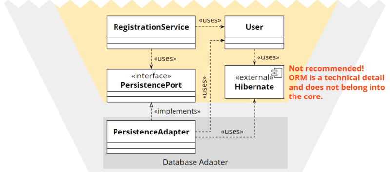

See https://www.happycoders.eu/software-craftsmanship/hexagonal-architecture-java/
SEE https://www.happycoders.eu/software-craftsmanship/hexagonal-architecture/

### Domain

 The application provides the (highly simplified) backend for an online store that includes the following functionalities:

1. Searching for products
2. Adding a product to the shopping cart
3. Retrieving the shopping cart with the products, their respective quantity, and the total price
4. Emptying the shopping cart

In the business logic, we want to ensure the following pre- and postconditions:

- The amount of a product added to the cart must be at least one.
- After adding a product, the total quantity of this product in the cart must not exceed the amount of the product available in the warehouse.

In addition, we will take a test-driven approach:

- For each domain entity, we write a unit test.
- For each domain service, we write a unit test.
- For each adapter, we write an integration test.
- We write end-to-end tests for the most critical use cases.

In the application hexagon, we implement the primary (left) and secondary ports (right) as well as the domain services – that is, the business functions (in the form of individual use cases), which in turn access the secondary ports as well as the business logic of the model classes.

We will connect three types of adapters to the ports:

- To the primary port: a REST adapter through which we can call the store functions.
- To the secondary port: an in-memory adapter that stores the shop data in RAM.
- In the next part of this series, also to the secondary port: a JPA adapter that persists the shop data to a MySQL database via Hibernate.

Finally, the Bootstrap component will instantiate the domain services and adapters, launch a web server, and deploy the application on the server.

The black arrows represent the method call directions, and the white arrows the source code dependency direction (“dependency rule”).

### Application

In the application hexagon, implement ports and domain services for the following use cases:

1. Searching for products
   
> Use case description: The customer should be able to enter a text in a search field. The search text should be at least two characters long. The search should return all products where the search text appears in the title or the description.  

2. Adding a product to the shopping cart

> Use case description: The customer should be able to add a product in a certain quantity to their shopping cart.  

3. Retrieving the shopping cart with the products, their respective quantity, and the total price

> Use case description: The customer should be able to retrieve their shopping cart, including the products, their respective quantity, the total number of products, and the total price.  

4. Emptying the shopping cart

> Use case description: The customer should be able to empty their shopping cart.  

### Adapters

We still need adapters:

- REST adapters to call the use cases, and
- Persistence adapters to store shopping carts and products.

We create a REST adapter for each of the primary ports (use cases) and an in-memory persistence adapter for each of the secondary ports (repositories):

We could also create, for example, a cart REST adapter, a product REST adapter, and a single persistence adapter:

### Ports and Adapters

The isolation of business logic (referred to as “application” in the hexagonal architecture) from the outside world is achieved via so-called “ports” and “adapters,” as shown in the following diagram:

The business logic (“application”) is at the core of the architecture. It defines interfaces (“ports”) to communicate with the outside world – both to be controlled (by an API, by a user interface, by other applications) and to control (the database, external interfaces, and other infrastructure).

The business logic knows only these ports; all its use cases are implemented exclusively against the specifications of the ports. It is irrelevant for the business logic which technical details might be behind these ports.

### example

The following illustration shows an exemplary application which

1. is controlled by a user via a user interface,
2. is controlled by a user via a REST API,
3. is controlled by an external application via the same REST API,
4. controls a database and
5. controls an external application.

The connection to the external components is provided by “adapters.”

For example, the user interface could provide a registration form. When the user has filled in all the data and clicks “Register,” the UI adapter generates a “Register User” command and sends it to the business logic. Alternatively, the same command could be generated by the REST adapter for a corresponding HTTP POST request:

On the “other side” of the application, the database adapter could translate the “Store User” command into an “INSERT INTO User VALUES (…)” SQL query:

Several adapters can be connected to one port. For example, as in the example above, a user interface adapter and a REST adapter can both be connected to the port to control the application. And a port for sending notifications could have an email adapter, an SMS adapter, and a WhatsApp adapter connected to it.

### Primary and Secondary Ports and Adapters

From the example above, we have seen two types of ports and adapters – those that control the application and those that are controlled by the application.

We call the first group “primary” or “driving” ports and adapters; these are usually shown on the left side of the hexagon.

We refer to the second group as “secondary” or “driven” ports and adapters, usually shown on the right.

### Dependency Rule

In theory, this sounds quite good. But how do we programmatically ensure that no technical details (like JPA entities) and libraries (like O/R mappers) leak into the application?

We can find the answer in the so-called “dependency rule.” This rule states that all source code dependencies may only point from the outside inwards, i.e., in the direction of the application hexagon:

The mapping into classes and their relationships to each other is quite simple for primary ports and adapters (i.e., the left side of the image).

Staying with the user registration example, we could implement the desired architecture with something like the following classes:

The RegistrationController is the adapter, the RegistrationUseCase interface defines the primary port, and the RegistrationService implements the functionality described by the port.

But how do we implement the secondary ports and adapters, i.e., the right side of the image where the source code dependency must be opposite to the invocation direction? For example, how can the application core access the database if the database is outside the core and the source code dependency is to be directed to the center?	

This is where the dependency inversion principle comes into play.

#### Dependency Inversion

Also, the port is defined by an interface. However, the relationships between the classes are swapped: the PersistanceAdapter does not use the PersistencePort but implements it. And the RegistrationService does not implement the PersistencePort but uses it:

Employing the dependency inversion principle, we can choose the direction of a code dependency – for secondary ports and adapters opposite to the calling direction.

### Mapping

Isolating the technical details from the application core leads to a dilemma that becomes apparent, for example, when using an O/R mapper. Entity classes are usually annotated to instruct the mapper on which database table and columns to map the entity and its properties to, how to generate the primary key, and how to map collections to relations.

Since the application core is not supposed to know the technical details of the persistence adapter, we cannot provide such an entity with these technical annotations in the application core:

On the other hand, we cannot implement the entity in the adapter because then the application core would no longer have access to it:

How can we resolve this dilemma?

In the following sections, I’ll introduce you to different strategies for doing this.

#### Duplication With Two-Way Mapping

We create an additional model class in the adapter that does not contain any business logic but does contain the technical annotations. The adapter must then map the core’s model class to the adapter model class and vice versa.

In my experience, this variant is the most suitable.

#### Duplication With One-Way Mapping

We define an interface in the core and let both the core’s model class and the adapter’s model class implement this interface. Thus, only the model coming from the core needs to be translated into the adapter model. A translation towards the core is unnecessary: the adapter can send its own model class to the core since it implements the core’s interface.

This variant requires that the interface defines only the access methods for those fields to be persisted. Business logic methods must not be contained in the interface. I don’t like this strategy because it is less intuitive and, in my experience, is more overhead and less maintainable than two-way mapping.

#### Technical Instructions Outside the Program Code

Some libraries, such as Hibernate, allow the technical instructions to be defined in an XML file instead of using annotations in the model class. This allows the adapter to use the core’s model class without duplicating code.

However, external instructions are often much more confusing than annotations in the code, so I’m not particularly eager to use this strategy either.

#### Weakening the Architectural Boundaries

Ultimately, one can consciously decide to weaken the strict architectural boundaries, allow a dependency from the core to the ORM library, and place the annotations directly on the entity in the core.

I would always advise against this option. Once you start with it, it doesn’t take long – according to the broken windows theory – until the next architecture rule is dropped.

#### Mapping in the REST Adapter

Mapping is not only an issue with the database adapter but also with a REST adapter, for example. Often we don’t want to make all attributes of an entity visible through the interface (e.g., the primary key or the creation and modification date), and for some attributes, we need to define how to format them (e.g., date and time information).

We can also control this with technical annotations (e.g., @JsonIgnore or @JsonFormat when using Jackson). But we don’t want these in the application core either. Therefore, even with REST adapters, it usually makes sense to map an entity to an adapter-specific model class that contains only the visible fields and the formatting instructions.

### Tests

At the beginning of the article, I mentioned “isolated testable components” as one of the requirements for good software architecture. In fact, the hexagonal architecture makes it very easy for us (as you will also see in practice in the following parts of this article series) to test the business logic of the application:

- Tests can invoke the business logic through the primary ports.
- The secondary ports can be connected to test doubles, e.g., in the form of stubs to answer queries from the application or spies to record events sent by the application.

The following diagram shows a unit test that creates a test double for the database and connects it to the secondary database port (“Arrange”), invokes a use case on the primary port (“Act”), and verifies the port’s response and interaction with the test double (“Assert”):

Not only can the business logic be tested in isolation from the adapters, but the adapters can also be tested in isolation from the business logic (e.g., in the Java ecosystem, primary REST adapters with REST Assured, secondary REST adapters with WireMock, and database adapters with TestContainers).

The following diagram shows an integration test that creates a test double for the primary port (“Arrange”), sends an HTTP POST request to the REST adapter via REST Assured (“Act”), and finally verifies the HTTP response and interaction with the test double (“Assert”):

The last diagram shows an integration test for the database adapter that uses TestContainers to start up a test database (“Arrange”), calls a method on the database adapter (“Act”), and finally checks whether the return value of the method and, if applicable, the changes in the test database meet expectations (“Assert”):

In addition to these isolated tests, complete system tests should not be missing (to a lesser extent, according to the test pyramid).

### Why a Hexagon?

Alistair Cockburn is frequently asked whether the hexagon or the number “six” has a particular meaning. His answer to this question is: “No.” He wanted to use a shape that no one had used before. Squares are used everywhere, and pentagons are hard to draw. So it became a hexagon.

The hexagon is also great for drawing in two primary ports on the left and two secondary ports on the right. Cockburn says he’s never encountered a project that required more than four ports for its schematic representation.

### Hexagonal Architecture and DDD (Domain Driven Design)

In literature, one repeatedly finds representations of the hexagonal architecture with “entities” and “use cases” or “services” within the application hexagon and/or with a “domain” or “domain model” hexagon within the application hexagon – roughly as in the following figure:

In fact, the hexagonal architecture deliberately leaves open what is inside the application hexagon. In a fascinating interview, Alistair Cockburn answered the question, “What do you see inside the application?” with, “I don’t care – not my business. The hexagonal design pattern represents a single design decision: “Wrap your app in an API and put tests around it.”

Nevertheless, domain-driven design (DDD) and hexagonal architecture complement each other exceptionally well because the DDD discipline of tactical design is ideally suited to structure the business rules within the application hexagon.

I will, therefore, also use this additional domain hexagon in the following articles of this series, in which I will demonstrate the implementation of a hexagonal architecture with Java.	

### Hexagonal Architecture vs. Clean Architecture

“Clean architecture” was introduced in 2012 by Robert Martin (“Uncle Bob”) on his Clean Coder Blog and described in detail in the 2017 book “Clean Architecture.”

As in the hexagonal architecture, business logic is also at the center of clean architecture. Around it are the so-called interface adapters, which connect the core with the user interface, the database, and other external components. The core only knows the interfaces of the adapters but knows nothing about their concrete implementations and the components behind them.

In clean architecture, too, all source code dependencies point exclusively in the direction of the core. Where calls point from the inside to the outside, i.e., in the opposite direction to the source code dependency, the dependency inversion principle is applied.

The following diagram shows the hexagonal architecture and clean architecture side by side:

If we adjust the colors a bit in the hexagonal architecture and replace the concrete adapters and external components with nameless placeholders in the clean architecture, we get two very similar illustrations:

The hexagons can be mapped almost one-to-one to the clean architecture rings:

- The “external agencies” arranged around the outer hexagon correspond to the outer ring of the clean architecture, “frameworks & drivers.”
- The outer hexagon “adapters” corresponds to the ring “interface adapters.”
- The application hexagon corresponds to the “business rules” in the clean architecture. However, these are further subdivided into “enterprise-related business rules” (entities) and “application business rules” (use cases that orchestrate the entities and control the flow of data to and from them). On the other hand, the hexagonal architecture deliberately leaves the architecture within the application hexagon open.

The ports are not explicitly mentioned in clean architecture but are also present in the associated UML diagrams and source code examples in the form of interfaces:

In summary, both architectures are almost identical: the software is divided into layers, and all source code dependencies point from the outer to the inner layers. The application’s core knows no details of the outer layers and is implemented only against their interfaces. This creates a system whose technical details are interchangeable and which is fully testable without them.
