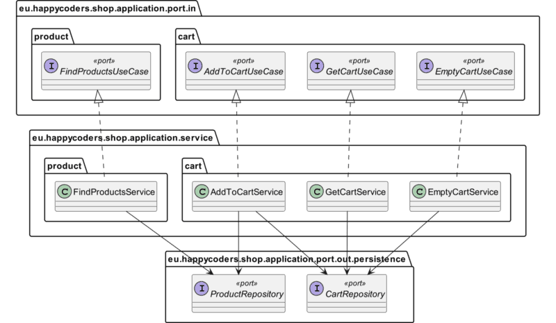

See https://www.happycoders.eu/software-craftsmanship/hexagonal-architecture-java/

### Domain

 The application provides the (highly simplified) backend for an online store that includes the following functionalities:

1. Searching for products
2. Adding a product to the shopping cart
3. Retrieving the shopping cart with the products, their respective quantity, and the total price
4. Emptying the shopping cart

In the business logic, we want to ensure the following pre- and postconditions:

- The amount of a product added to the cart must be at least one.
- After adding a product, the total quantity of this product in the cart must not exceed the amount of the product available in the warehouse.

In addition, we will take a test-driven approach:

- For each domain entity, we write a unit test.
- For each domain service, we write a unit test.
- For each adapter, we write an integration test.
- We write end-to-end tests for the most critical use cases.

In the application hexagon, we implement the primary (left) and secondary ports (right) as well as the domain services – that is, the business functions (in the form of individual use cases), which in turn access the secondary ports as well as the business logic of the model classes.

We will connect three types of adapters to the ports:

- To the primary port: a REST adapter through which we can call the store functions.
- To the secondary port: an in-memory adapter that stores the shop data in RAM.
- In the next part of this series, also to the secondary port: a JPA adapter that persists the shop data to a MySQL database via Hibernate.

Finally, the Bootstrap component will instantiate the domain services and adapters, launch a web server, and deploy the application on the server.

The black arrows represent the method call directions, and the white arrows the source code dependency direction (“dependency rule”).

### Application

In the application hexagon, implement ports and domain services for the following use cases:

1. Searching for products
   
> Use case description: The customer should be able to enter a text in a search field. The search text should be at least two characters long. The search should return all products where the search text appears in the title or the description.  

2. Adding a product to the shopping cart

> Use case description: The customer should be able to add a product in a certain quantity to their shopping cart.  

3. Retrieving the shopping cart with the products, their respective quantity, and the total price

> Use case description: The customer should be able to retrieve their shopping cart, including the products, their respective quantity, the total number of products, and the total price.  

4. Emptying the shopping cart

> Use case description: The customer should be able to empty their shopping cart.  

