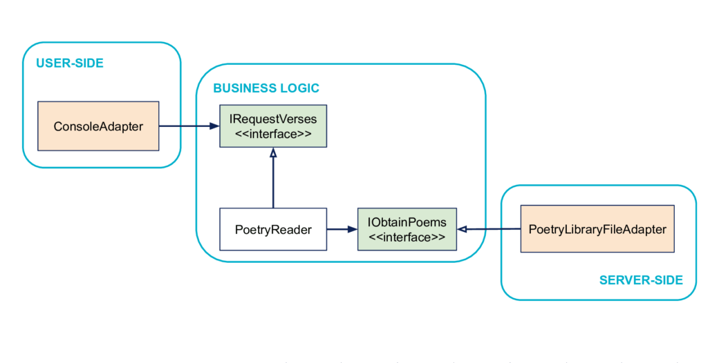

from https://rskupnik.github.io/framework-independence-with-hexagonal-architecture	
See https://fideloper.com/hexagonal-architecture
See https://github.com/rskupnik/pet-clinic-modular/tree/master
See http://gorodinski.com/blog/2012/04/14/services-in-domain-driven-design-ddd/
See https://github.com/citerus/dddsample-core
See https://beyondxscratch.com/2020/08/23/hexagonal-architecture-example-digging-a-spring-boot-implementation/

See https://blog.octo.com/hexagonal-architecture-three-principles-and-an-implementation-example/
See https://alistair.cockburn.us/hexagonal-architecture/
See https://reflectoring.io/spring-hexagonal/
See https://medium.com/@msandin/strategies-for-organizing-code-2c9d690b6f33
See https://martinfowler.com/bliki/PresentationDomainDataLayering.html

See https://dev.to/bertilmuth/implementing-a-hexagonal-architecture-1kgf

### Principles of Hexagonal Architecture

#### Principle: Separate User-Side, Business Logic and Server-Side

#### Illustration: a small example of an application

####  Principle: dependencies go inside

#### Inside and outside

#### Principle: boundaries are isolated with interfaces

#### A Metaphor: Ports & Adapters

#### Another Metaphor: the Hexagone

#### Detail: Dependencies inversion on the right

#### Detail: Why an Interface on the left?

#### Testing in Hexagonal Architecture

##### How to replace some code from the User-Side?

##### How to replace some code of the Server-Side?

!
